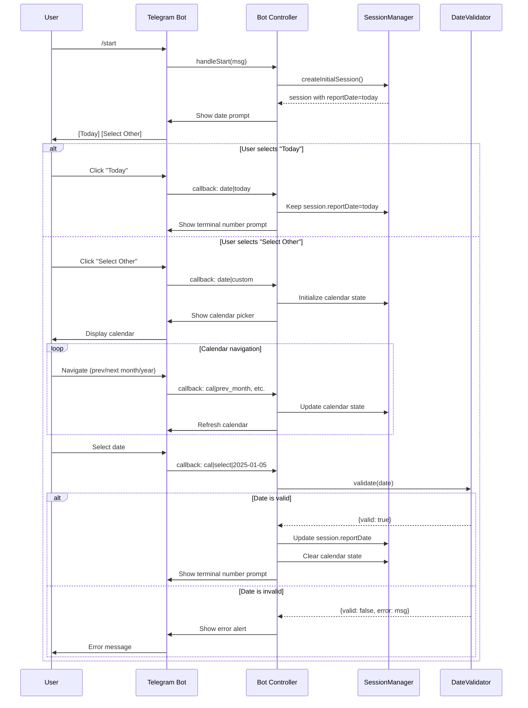
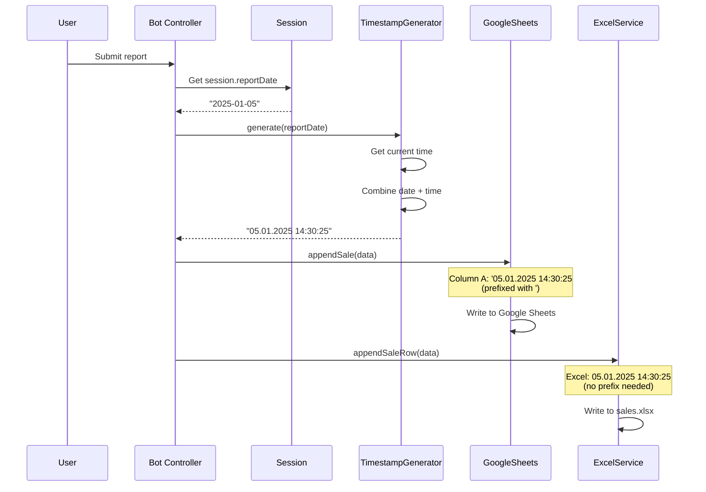
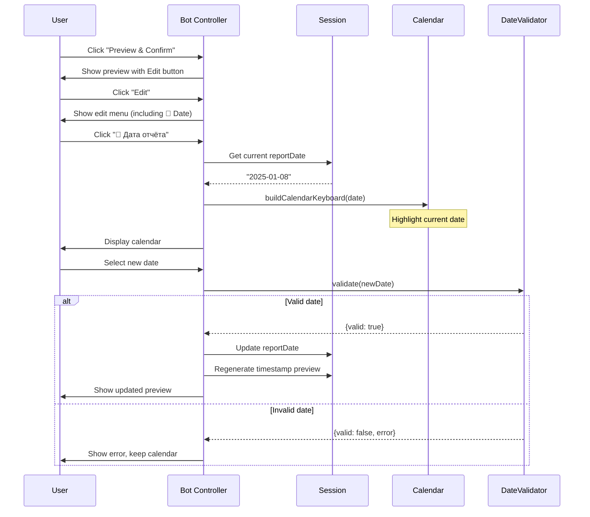

# Design Document: Date Selection for Reports

## Overview

This feature adds date selection capability to the Impulse Device Sales Bot, enabling users to fill sales reports for past dates while maintaining the current date as the default for daily workflows. The implementation extends the existing state machine flow with a new date selection step at the beginning, providing an interactive calendar picker for custom date selection.

### Current System Behavior

The bot currently operates on a fixed "current date" paradigm:
- Users invoke `/start` to begin the report flow
- The system immediately prompts for terminal number (Step 1/10)
- Timestamp is generated at submission time using `new Date().toLocaleString('ru-RU', { timeZone: 'Europe/Moscow' })`
- No mechanism exists to fill reports for past dates

### Proposed Enhancement

Add a date selection step **before** terminal number input:
- Users see date prompt: "Today" or "Select Other Date"
- Default flow (Today) maintains current behavior
- Custom flow displays interactive calendar picker
- Selected date persists through entire report flow
- Timestamp combines selected date + actual submission time
- Session structure extended with `reportDate` field

## Architecture

### High-Level Component Integration

```mermaid
graph TD
    A[/start Command] --> B{Admin Mode?}
    B -->|Yes| C[Admin Panel]
    B -->|No| D[Date Selection Prompt]
    D --> E{User Choice}
    E -->|Today| F[Store Current Date]
    E -->|Select Other| G[Calendar Picker]
    G --> H[Date Validation]
    H -->|Valid| I[Store Custom Date]
    H -->|Invalid| J[Error + Retry]
    J --> G
    F --> K[Terminal Number Input]
    I --> K
    K --> L[Existing Flow: Manager → Channel → ...]
    L --> M[Preview with Date Display]
    M --> N[Final Submission]
    N --> O[Timestamp Generation<br/>Date + Time]
    O --> P[Google Sheets & Excel Storage]
```

### System Flow Modification

**Before (Current):**
```
/start → terminal_number → manager → channel → city → terminal → ...
```

**After (Proposed):**
```
/start → date_select → terminal_number → manager → channel → city → terminal → ...
```


### Architectural Layers

```
┌─────────────────────────────────────────────────────────┐
│                    Presentation Layer                    │
│  - Telegram inline keyboards (date prompt + calendar)   │
│  - Webchat HTML controls (date input)                   │
│  - Miniapp date picker components                       │
└─────────────────────────────────────────────────────────┘
                            ↓
┌─────────────────────────────────────────────────────────┐
│                  Controller Layer (bot.js)              │
│  - handleStart() → initiate date selection              │
│  - handleCallback() → process date choices              │
│  - Date prompt rendering                                │
│  - Calendar navigation logic                            │
└─────────────────────────────────────────────────────────┘
                            ↓
┌─────────────────────────────────────────────────────────┐
│               Session Management Layer                   │
│  - createInitialSession() → add reportDate field        │
│  - Session.reportDate: ISO 8601 string (YYYY-MM-DD)    │
│  - Date persistence across all flow steps               │
└─────────────────────────────────────────────────────────┘
                            ↓
┌─────────────────────────────────────────────────────────┐
│                    Business Logic Layer                  │
│  - DateValidator: validate date constraints             │
│  - DateFormatter: convert ISO ↔ DD.MM.YYYY             │
│  - TimestampGenerator: combine date + time              │
└─────────────────────────────────────────────────────────┘
                            ↓
┌─────────────────────────────────────────────────────────┐
│                     Data Layer                           │
│  - googleSheets.appendSale() → column A timestamp       │
│  - dataService.appendSaleRow() → Excel timestamp        │
│  - Format: 'DD.MM.YYYY HH:MM:SS (prefixed with ')      │
└─────────────────────────────────────────────────────────┘
```

## Components and Interfaces

### 1. Session Structure Extension

**Current Session Object:**
```javascript
{
  step: 'terminal_number',
  platform: 'telegram',
  timestamp: '08.01.2025, 14:30:25',
  items: [],
  lastMsgId: 12345,
  terminalNumber: '...',
  manager: '...',
  // ... other fields
}
```

**Extended Session Object:**
```javascript
{
  step: 'date_select',           // NEW: Initial step
  platform: 'telegram',
  reportDate: '2025-01-08',      // NEW: ISO 8601 format (YYYY-MM-DD)
  timestamp: '08.01.2025, 14:30:25',  // Still used for submission time
  items: [],
  lastMsgId: 12345,
  
  // Calendar state (temporary, cleared after selection)
  _calendarMonth: 0,             // NEW: 0 = current month, -1 = previous, etc.
  _calendarYear: 2025,           // NEW: Year being displayed
  
  // Rest of existing fields...
  terminalNumber: '...',
  manager: '...',
  // ...
}
```


### 2. Date Selection Prompt Component

**Callback Data Protocol:**
```javascript
// Date prompt actions
'date|today'           // User selects today
'date|custom'          // User opens calendar picker

// Calendar navigation
'cal|prev_month'       // Navigate to previous month
'cal|next_month'       // Navigate to next month
'cal|prev_year'        // Navigate to previous year
'cal|next_year'        // Navigate to next year

// Date selection
'cal|select|YYYY-MM-DD'  // User selects specific date (e.g., 'cal|select|2025-01-05')
```

**Telegram Inline Keyboard Layout:**
```
┌────────────────────────────────────────┐
│  📅 Выберите дату отчёта               │
│                                        │
│  ┌─────────────────────────────────┐  │
│  │ 📅 Сегодня (08.01.2025)         │  │
│  └─────────────────────────────────┘  │
│  ┌─────────────────────────────────┐  │
│  │ 📆 Выбрать другую дату          │  │
│  └─────────────────────────────────┘  │
└────────────────────────────────────────┘
```

### 3. Calendar Picker Component

**Visual Layout (Telegram Inline Keyboard):**
```
┌────────────────────────────────────────┐
│        Январь 2025                     │
│  [◄◄ Год]  [◄ Месяц]  [Месяц ►] [Год ►►]
│                                        │
│   Пн  Вт  Ср  Чт  Пт  Сб  Вс          │
│   --  --  1   2   3   4   5           │
│   6   7   8*  9   10  11  12          │  (* = сегодня)
│   13  14  15  16  17  18  19          │
│   20  21  22  23  24  25  26          │
│   27  28  29  30  31  --  --          │
└────────────────────────────────────────┘

Legend:
 * = Current date (highlighted)
 Grey = Disabled (future dates)
 -- = Empty cells (padding)
```

**Implementation Details:**

```javascript
// Calendar button structure
function buildCalendarKeyboard(year, month, currentDate) {
  const rows = [];
  
  // Header: Month and year with navigation
  rows.push([
    { text: '◄◄', callback_data: 'cal|prev_year' },
    { text: '◄', callback_data: 'cal|prev_month' },
    { text: `${MONTHS_RU[month]} ${year}`, callback_data: 'cal|info' },
    { text: '►', callback_data: 'cal|next_month' },
    { text: '►►', callback_data: 'cal|next_year' }
  ]);
  
  // Day headers
  rows.push(DAYS_RU.map(day => ({ text: day, callback_data: 'cal|noop' })));
  
  // Date grid (6 weeks max)
  const firstDay = new Date(year, month, 1).getDay();
  const daysInMonth = new Date(year, month + 1, 0).getDate();
  
  // ... grid generation logic ...
  
  return { inline_keyboard: rows };
}
```


### 4. Date Validator Component

**Interface:**
```javascript
class DateValidator {
  /**
   * Validates if date meets business constraints
   * @param {string} dateStr - Date in YYYY-MM-DD format
   * @returns {Object} { valid: boolean, error: string|null }
   */
  static validate(dateStr) {
    const date = new Date(dateStr);
    const today = new Date();
    today.setHours(0, 0, 0, 0);
    
    // Check 1: Valid date format
    if (isNaN(date.getTime())) {
      return { valid: false, error: 'Некорректная дата' };
    }
    
    // Check 2: Not in future
    if (date > today) {
      return { valid: false, error: 'Нельзя выбрать будущую дату' };
    }
    
    // Check 3: Not older than 90 days
    const maxPastDate = new Date(today);
    maxPastDate.setDate(maxPastDate.getDate() - 90);
    
    if (date < maxPastDate) {
      return { valid: false, error: 'Можно выбрать дату не старше 90 дней' };
    }
    
    return { valid: true, error: null };
  }
  
  /**
   * Check if date should be disabled in calendar
   * @param {Date} date
   * @returns {boolean}
   */
  static isDisabled(date) {
    return !this.validate(this.toISO(date)).valid;
  }
  
  static toISO(date) {
    return date.toISOString().split('T')[0];
  }
}
```

### 5. Date Formatter Component

**Interface:**
```javascript
class DateFormatter {
  /**
   * Convert ISO date to display format
   * @param {string} isoDate - YYYY-MM-DD
   * @returns {string} DD.MM.YYYY
   */
  static toDisplay(isoDate) {
    const [year, month, day] = isoDate.split('-');
    return `${day}.${month}.${year}`;
  }
  
  /**
   * Convert display format to ISO
   * @param {string} displayDate - DD.MM.YYYY
   * @returns {string} YYYY-MM-DD
   */
  static toISO(displayDate) {
    const [day, month, year] = displayDate.split('.');
    return `${year}-${month}-${day}`;
  }
  
  /**
   * Get localized date string
   * @param {string} isoDate - YYYY-MM-DD
   * @returns {string} Russian date representation
   */
  static toRussian(isoDate) {
    const date = new Date(isoDate);
    return date.toLocaleDateString('ru-RU', {
      day: 'numeric',
      month: 'long',
      year: 'numeric'
    });
  }
}
```


### 6. Timestamp Generator Component

**Interface:**
```javascript
class TimestampGenerator {
  /**
   * Generate timestamp combining selected date + current time
   * @param {string} reportDate - ISO format YYYY-MM-DD
   * @returns {string} DD.MM.YYYY HH:MM:SS
   */
  static generate(reportDate) {
    const now = new Date();
    const [year, month, day] = reportDate.split('-');
    
    const hours = String(now.getHours()).padStart(2, '0');
    const minutes = String(now.getMinutes()).padStart(2, '0');
    const seconds = String(now.getSeconds()).padStart(2, '0');
    
    return `${day}.${month}.${year} ${hours}:${minutes}:${seconds}`;
  }
  
  /**
   * Get current timestamp (for "Today" flow)
   * @returns {string} DD.MM.YYYY HH:MM:SS
   */
  static getCurrentTimestamp() {
    const now = new Date();
    return now.toLocaleString('ru-RU', { 
      timeZone: 'Europe/Moscow',
      year: 'numeric',
      month: '2-digit',
      day: '2-digit',
      hour: '2-digit',
      minute: '2-digit',
      second: '2-digit'
    }).replace(',', '');
  }
}
```

### 7. Russian Localization Constants

**Month and Day Names:**
```javascript
const MONTHS_RU = [
  'Январь',    // January
  'Февраль',   // February
  'Март',      // March
  'Апрель',    // April
  'Май',       // May
  'Июнь',      // June
  'Июль',      // July
  'Август',    // August
  'Сентябрь',  // September
  'Октябрь',   // October
  'Ноябрь',    // November
  'Декабрь'    // December
];

const DAYS_RU = ['Пн', 'Вт', 'Ср', 'Чт', 'Пт', 'Сб', 'Вс'];
const DAYS_FULL_RU = [
  'Понедельник',
  'Вторник',
  'Среда',
  'Четверг',
  'Пятница',
  'Суббота',
  'Воскресенье'
];

// Calendar navigation labels
const CALENDAR_LABELS = {
  prevYear: '◄◄ Год',
  prevMonth: '◄ Назад',
  nextMonth: 'Вперёд ►',
  nextYear: 'Год ►►',
  today: 'Сегодня',
  selectOther: 'Выбрать другую дату',
  chooseDate: 'Выберите дату отчёта',
  invalidFuture: '❌ Нельзя выбрать будущую дату',
  invalidOld: '❌ Можно выбрать дату не старше 90 дней',
  invalidFormat: '❌ Некорректная дата'
};
```


## Data Models

### Session Data Model

```typescript
interface Session {
  // Existing fields
  step: string;                    // Current flow step
  platform: string;                // 'telegram' | 'web' | 'miniapp'
  timestamp: string;               // Submission timestamp (DD.MM.YYYY HH:MM:SS)
  items: Product[];                // Product list
  lastMsgId: number | null;        // Last message ID for editing
  
  // NEW: Date selection fields
  reportDate: string;              // ISO 8601: YYYY-MM-DD (e.g., '2025-01-08')
  _calendarMonth?: number;         // Temporary: month offset from current (0, -1, -2, etc.)
  _calendarYear?: number;          // Temporary: year being displayed
  
  // Report data fields
  terminalNumber?: string;
  manager?: string;
  channel?: string;
  city?: string;
  terminal?: string;
  cash?: number;
  cashless?: number;
  credit?: number;
  encashment?: number;
  receiptUrl?: string;
  businessTripAllowance?: number;
  totalRevenue?: number;
  transactionId?: string;
  _page?: number;                  // Pagination state
}

interface Product {
  productName: string;
  quantity: number;
  unitPrice: number;
  lineTotal: number;
  comment?: string;
}
```

### Calendar State Model

```typescript
interface CalendarState {
  year: number;           // Year being displayed
  month: number;          // Month (0-11)
  currentDate: Date;      // Today's date
  selectedDate: Date | null;  // User's selected date
  minDate: Date;          // 90 days ago
  maxDate: Date;          // Today
}

interface CalendarCell {
  date: number;           // Day of month (1-31)
  fullDate: Date;         // Complete date object
  isCurrentMonth: boolean; // Is in displayed month
  isToday: boolean;       // Is today
  isSelected: boolean;    // Is selected by user
  isDisabled: boolean;    // Is disabled (future or > 90 days old)
}
```

### Storage Data Model

**Google Sheets Row (Продажи_Заголовки):**
```
Column A: 'DD.MM.YYYY HH:MM:SS  (prefixed with single quote)
Column B: Terminal Number
Column C: Manager
Column D: Channel
Column E: City
Column F: Terminal Name
Column G: Cash
Column H: Cashless
Column I: Credit
Column J: Encashment
Column K: Receipt URL
Column L: Business Trip Allowance
Column M: Total Revenue
Column N: Comment
Column O: Transaction ID
```

**Excel Row (sales.xlsx → Продажи_Заголовки):**
Same structure as Google Sheets, but without quote prefix (ExcelJS handles formatting).


## API Contracts

### 1. Bot.js Method Signatures

```javascript
class ImpulseBot {
  /**
   * Initialize session with date selection step
   * Modified to include reportDate field
   */
  createInitialSession(platform) {
    const today = new Date();
    return {
      step: 'date_select',  // CHANGED: was 'terminal_number'
      platform,
      reportDate: today.toISOString().split('T')[0],  // NEW: default to today
      timestamp: today.toLocaleString('ru-RU', { timeZone: 'Europe/Moscow' }),
      items: [],
      lastMsgId: null
    };
  }
  
  /**
   * Handle /start command
   * Modified to show date selection prompt
   */
  async handleStart(msg) {
    // ... existing logic ...
    await this.showDatePrompt(chatId, userId, session);
  }
  
  /**
   * Display date selection prompt
   * NEW METHOD
   */
  async showDatePrompt(chatId, userId, session) {
    const today = DateFormatter.toDisplay(session.reportDate);
    const keyboard = {
      inline_keyboard: [
        [{ text: `📅 Сегодня (${today})`, callback_data: 'date|today' }],
        [{ text: '📆 Выбрать другую дату', callback_data: 'date|custom' }]
      ]
    };
    
    await this.sendAndReplace(chatId, userId, session,
      `📅 Выберите дату отчёта:`,
      { reply_markup: keyboard }
    );
  }
  
  /**
   * Display calendar picker
   * NEW METHOD
   */
  async showCalendar(chatId, userId, session) {
    const year = session._calendarYear || new Date().getFullYear();
    const month = session._calendarMonth || new Date().getMonth();
    
    const keyboard = buildCalendarKeyboard(year, month, session.reportDate);
    
    await this.sendAndReplace(chatId, userId, session,
      `📆 Выберите дату:\n\n${MONTHS_RU[month]} ${year}`,
      { reply_markup: keyboard }
    );
  }
  
  /**
   * Handle date-related callbacks
   * NEW METHOD
   */
  async handleDateCallback(chatId, userId, session, data) {
    if (data === 'date|today') {
      session.reportDate = new Date().toISOString().split('T')[0];
      session.step = 'terminal_number';
      await this.showTerminalNumberPrompt(chatId, userId, session);
    } else if (data === 'date|custom') {
      session._calendarYear = new Date().getFullYear();
      session._calendarMonth = new Date().getMonth();
      await this.showCalendar(chatId, userId, session);
    } else if (data.startsWith('cal|')) {
      await this.handleCalendarNavigation(chatId, userId, session, data);
    }
  }
  
  /**
   * Handle calendar navigation
   * NEW METHOD
   */
  async handleCalendarNavigation(chatId, userId, session, data) {
    const [_, action, value] = data.split('|');
    
    switch (action) {
      case 'prev_month':
        session._calendarMonth--;
        if (session._calendarMonth < 0) {
          session._calendarMonth = 11;
          session._calendarYear--;
        }
        break;
      case 'next_month':
        session._calendarMonth++;
        if (session._calendarMonth > 11) {
          session._calendarMonth = 0;
          session._calendarYear++;
        }
        break;
      case 'prev_year':
        session._calendarYear--;
        break;
      case 'next_year':
        session._calendarYear++;
        break;
      case 'select':
        const validation = DateValidator.validate(value);
        if (validation.valid) {
          session.reportDate = value;
          session.step = 'terminal_number';
          delete session._calendarMonth;
          delete session._calendarYear;
          await this.showTerminalNumberPrompt(chatId, userId, session);
          return;
        } else {
          await this.bot.answerCallbackQuery(query.id, {
            text: validation.error,
            show_alert: true
          });
          return;
        }
    }
    
    await this.showCalendar(chatId, userId, session);
  }
}
```


### 2. Calendar Builder Function

```javascript
/**
 * Build calendar keyboard for Telegram
 * @param {number} year - Year to display
 * @param {number} month - Month to display (0-11)
 * @param {string} selectedDate - Currently selected date (ISO format)
 * @returns {Object} Telegram inline keyboard
 */
function buildCalendarKeyboard(year, month, selectedDate) {
  const rows = [];
  const today = new Date();
  today.setHours(0, 0, 0, 0);
  
  const maxPastDate = new Date(today);
  maxPastDate.setDate(maxPastDate.getDate() - 90);
  
  // Header row: navigation
  rows.push([
    { text: '◄◄', callback_data: 'cal|prev_year' },
    { text: '◄', callback_data: 'cal|prev_month' },
    { text: `${MONTHS_RU[month]} ${year}`, callback_data: 'cal|noop' },
    { text: '►', callback_data: 'cal|next_month' },
    { text: '►►', callback_data: 'cal|next_year' }
  ]);
  
  // Day headers
  rows.push(DAYS_RU.map(day => ({ 
    text: day, 
    callback_data: 'cal|noop' 
  })));
  
  // Calculate first day of month (0 = Sunday, 1 = Monday, etc.)
  const firstDay = new Date(year, month, 1).getDay();
  const adjustedFirstDay = firstDay === 0 ? 6 : firstDay - 1; // Monday = 0
  
  const daysInMonth = new Date(year, month + 1, 0).getDate();
  
  // Build calendar grid
  let dayCounter = 1;
  for (let week = 0; week < 6; week++) {
    const weekRow = [];
    
    for (let dayOfWeek = 0; dayOfWeek < 7; dayOfWeek++) {
      if ((week === 0 && dayOfWeek < adjustedFirstDay) || dayCounter > daysInMonth) {
        weekRow.push({ text: ' ', callback_data: 'cal|noop' });
      } else {
        const cellDate = new Date(year, month, dayCounter);
        const isoDate = cellDate.toISOString().split('T')[0];
        const isToday = cellDate.getTime() === today.getTime();
        const isSelected = isoDate === selectedDate;
        const isFuture = cellDate > today;
        const isTooOld = cellDate < maxPastDate;
        const isDisabled = isFuture || isTooOld;
        
        let text = String(dayCounter);
        if (isToday) text = `[${text}]`;  // Highlight today
        if (isSelected) text = `✓${text}`;  // Mark selected
        
        weekRow.push({
          text: text,
          callback_data: isDisabled ? 'cal|noop' : `cal|select|${isoDate}`
        });
        
        dayCounter++;
      }
    }
    
    rows.push(weekRow);
    
    if (dayCounter > daysInMonth) break;
  }
  
  return { inline_keyboard: rows };
}
```


### 3. Message Display Updates

All step messages must include the selected date at the top:

```javascript
/**
 * Format step message with date header
 * @param {Session} session
 * @param {string} stepMessage - The step-specific message
 * @returns {string} Message with date header
 */
function formatMessageWithDate(session, stepMessage) {
  const displayDate = DateFormatter.toDisplay(session.reportDate);
  return `📅 Дата отчёта: ${displayDate}\n\n${stepMessage}`;
}

// Example usage in handleStart after date selection:
await this.sendAndReplace(chatId, userId, session,
  formatMessageWithDate(session, `🔢 Шаг 1/10 — Введите номер терминала:`)
);
```

### 4. Edit Mode Integration

Update the edit menu to include date editing:

```javascript
async handleEditCallback(query, session) {
  if (query.data === 'preview_edit') {
    session.step = 'edit_choose';
    await this.sendAndReplace(chatId, userId, session, '✏️ Что хотите изменить?', {
      reply_markup: {
        inline_keyboard: [
          [{ text: '📅 Дата отчёта', callback_data: 'edit|date' }],  // NEW
          [{ text: '💰 Суммы оплат', callback_data: 'edit|payments' }],
          [{ text: '📦 Товары', callback_data: 'edit|items' }],
          [{ text: '➕ Добавить товар', callback_data: 'edit|add_item' }],
          [{ text: '👤 Менеджер', callback_data: 'edit|manager' }],
          [{ text: '❌ Отмена — в начало', callback_data: 'edit|cancel' }]
        ]
      }
    });
  } else if (query.data === 'edit|date') {
    // Show calendar with current date highlighted
    session._calendarYear = new Date(session.reportDate).getFullYear();
    session._calendarMonth = new Date(session.reportDate).getMonth();
    await this.showCalendar(chatId, userId, session);
  }
}
```

### 5. Final Submission Timestamp Generation

```javascript
async finalSubmit(chatId, userId, session) {
  // Generate transaction ID
  this.ensureTransactionId(session);
  
  // Generate timestamp using selected reportDate + current time
  const timestamp = TimestampGenerator.generate(session.reportDate);
  
  // Calculate total revenue
  const totalRevenue = (session.cash || 0) + (session.cashless || 0) + (session.credit || 0);
  
  const data = {
    transactionId: session.transactionId,
    timestamp: timestamp,  // CHANGED: now uses reportDate
    terminalNumber: session.terminalNumber,
    manager: session.manager,
    channel: session.channel,
    city: session.city,
    terminal: session.terminal,
    cash: session.cash || 0,
    cashless: session.cashless || 0,
    credit: session.credit || 0,
    encashment: session.encashment || 0,
    receiptUrl: session.receiptUrl || '',
    businessTripAllowance: session.businessTripAllowance || 0,
    totalRevenue: totalRevenue,
    items: session.items || []
  };
  
  // Save to Google Sheets and Excel
  await sheets.appendSale(data);
  
  // ... rest of submission logic
}
```


## Data Flow Diagrams

### Date Selection Flow



### Timestamp Generation Flow




### Edit Mode Date Change Flow



## Error Handling

### Date Validation Errors

**Error Types:**
```javascript
const DATE_ERRORS = {
  FUTURE_DATE: {
    code: 'ERR_FUTURE_DATE',
    message: '❌ Нельзя выбрать будущую дату',
    severity: 'warning'
  },
  TOO_OLD: {
    code: 'ERR_DATE_TOO_OLD',
    message: '❌ Можно выбрать дату не старше 90 дней',
    severity: 'warning'
  },
  INVALID_FORMAT: {
    code: 'ERR_INVALID_DATE',
    message: '❌ Некорректная дата',
    severity: 'error'
  },
  PARSE_ERROR: {
    code: 'ERR_PARSE',
    message: '❌ Ошибка обработки даты',
    severity: 'error'
  }
};
```

**Error Handling Strategy:**

1. **User Input Errors (Future Date, Too Old):**
   - Show Telegram alert (popup)
   - Keep calendar open for retry
   - Log warning

2. **System Errors (Parse Error, Invalid Format):**
   - Show error message in chat
   - Reset to current date
   - Log error with stack trace

3. **Storage Errors:**
   - If timestamp generation fails, use fallback current timestamp
   - Log error but don't block submission
   - Notify user of partial success

**Error Recovery:**
```javascript
async handleDateSelection(chatId, userId, session, dateStr) {
  try {
    const validation = DateValidator.validate(dateStr);
    
    if (!validation.valid) {
      // User-facing validation error
      await this.bot.answerCallbackQuery(query.id, {
        text: validation.error,
        show_alert: true
      });
      // Calendar remains open
      return;
    }
    
    session.reportDate = dateStr;
    session.step = 'terminal_number';
    
    // Clear calendar state
    delete session._calendarMonth;
    delete session._calendarYear;
    
    await this.showTerminalNumberPrompt(chatId, userId, session);
    
  } catch (error) {
    console.error('Date selection error:', error);
    
    // Fallback to today
    session.reportDate = new Date().toISOString().split('T')[0];
    
    await this.bot.sendMessage(chatId, 
      '⚠️ Произошла ошибка при выборе даты. Используется текущая дата.'
    );
    
    await this.showTerminalNumberPrompt(chatId, userId, session);
  }
}
```


### Session State Recovery

If session is corrupted or reportDate is missing:

```javascript
function validateAndRepairSession(session) {
  // Ensure reportDate exists and is valid
  if (!session.reportDate) {
    console.warn('Missing reportDate in session, setting to today');
    session.reportDate = new Date().toISOString().split('T')[0];
  }
  
  // Validate reportDate format
  const dateRegex = /^\d{4}-\d{2}-\d{2}$/;
  if (!dateRegex.test(session.reportDate)) {
    console.warn('Invalid reportDate format:', session.reportDate);
    session.reportDate = new Date().toISOString().split('T')[0];
  }
  
  // Validate date is not in future
  const reportDate = new Date(session.reportDate);
  const today = new Date();
  today.setHours(0, 0, 0, 0);
  
  if (reportDate > today) {
    console.warn('Future reportDate detected:', session.reportDate);
    session.reportDate = today.toISOString().split('T')[0];
  }
  
  return session;
}
```

### Timestamp Generation Fallback

```javascript
function generateTimestampSafe(reportDate) {
  try {
    return TimestampGenerator.generate(reportDate);
  } catch (error) {
    console.error('Timestamp generation failed:', error);
    // Fallback to current timestamp
    return TimestampGenerator.getCurrentTimestamp();
  }
}
```

## Testing Strategy

### Unit Tests

**Date Validator Tests:**
```javascript
describe('DateValidator', () => {
  test('accepts today', () => {
    const today = new Date().toISOString().split('T')[0];
    expect(DateValidator.validate(today).valid).toBe(true);
  });
  
  test('rejects future dates', () => {
    const tomorrow = new Date();
    tomorrow.setDate(tomorrow.getDate() + 1);
    const result = DateValidator.validate(tomorrow.toISOString().split('T')[0]);
    expect(result.valid).toBe(false);
    expect(result.error).toContain('будущую дату');
  });
  
  test('rejects dates older than 90 days', () => {
    const oldDate = new Date();
    oldDate.setDate(oldDate.getDate() - 91);
    const result = DateValidator.validate(oldDate.toISOString().split('T')[0]);
    expect(result.valid).toBe(false);
    expect(result.error).toContain('90 дней');
  });
  
  test('accepts date exactly 90 days ago', () => {
    const date = new Date();
    date.setDate(date.getDate() - 90);
    expect(DateValidator.validate(date.toISOString().split('T')[0]).valid).toBe(true);
  });
});
```

**Date Formatter Tests:**
```javascript
describe('DateFormatter', () => {
  test('converts ISO to display format', () => {
    expect(DateFormatter.toDisplay('2025-01-08')).toBe('08.01.2025');
  });
  
  test('converts display to ISO format', () => {
    expect(DateFormatter.toISO('08.01.2025')).toBe('2025-01-08');
  });
  
  test('roundtrip conversion', () => {
    const original = '2025-01-08';
    const display = DateFormatter.toDisplay(original);
    const back = DateFormatter.toISO(display);
    expect(back).toBe(original);
  });
});
```

**Timestamp Generator Tests:**
```javascript
describe('TimestampGenerator', () => {
  test('combines date and time correctly', () => {
    const reportDate = '2025-01-08';
    const timestamp = TimestampGenerator.generate(reportDate);
    expect(timestamp).toMatch(/^08\.01\.2025 \d{2}:\d{2}:\d{2}$/);
  });
  
  test('uses current time component', () => {
    const before = new Date();
    const timestamp = TimestampGenerator.generate('2025-01-08');
    const after = new Date();
    
    const [, timeStr] = timestamp.split(' ');
    const [hours, minutes, seconds] = timeStr.split(':').map(Number);
    const tsTime = new Date();
    tsTime.setHours(hours, minutes, seconds);
    
    expect(tsTime.getTime()).toBeGreaterThanOrEqual(before.getTime());
    expect(tsTime.getTime()).toBeLessThanOrEqual(after.getTime());
  });
});
```


### Integration Tests

**Flow Tests:**
```javascript
describe('Date Selection Flow', () => {
  let bot, session;
  
  beforeEach(() => {
    bot = new ImpulseBot();
    session = bot.createInitialSession('telegram');
  });
  
  test('default flow uses today', async () => {
    // User selects "Today"
    await bot.handleDateCallback(chatId, userId, session, 'date|today');
    
    const today = new Date().toISOString().split('T')[0];
    expect(session.reportDate).toBe(today);
    expect(session.step).toBe('terminal_number');
  });
  
  test('custom date flow opens calendar', async () => {
    // User selects "Select Other"
    await bot.handleDateCallback(chatId, userId, session, 'date|custom');
    
    expect(session._calendarYear).toBeDefined();
    expect(session._calendarMonth).toBeDefined();
  });
  
  test('calendar navigation updates state', async () => {
    session._calendarYear = 2025;
    session._calendarMonth = 0; // January
    
    // Navigate to next month
    await bot.handleCalendarNavigation(chatId, userId, session, 'cal|next_month');
    
    expect(session._calendarMonth).toBe(1); // February
  });
  
  test('date selection clears calendar state', async () => {
    session._calendarYear = 2025;
    session._calendarMonth = 0;
    
    // Select a valid date
    const validDate = new Date();
    validDate.setDate(validDate.getDate() - 1); // Yesterday
    const isoDate = validDate.toISOString().split('T')[0];
    
    await bot.handleCalendarNavigation(chatId, userId, session, `cal|select|${isoDate}`);
    
    expect(session.reportDate).toBe(isoDate);
    expect(session._calendarMonth).toBeUndefined();
    expect(session._calendarYear).toBeUndefined();
    expect(session.step).toBe('terminal_number');
  });
});
```

**Storage Tests:**
```javascript
describe('Timestamp Storage', () => {
  test('Google Sheets receives prefixed timestamp', async () => {
    const mockAppend = jest.spyOn(sheets.sheets.spreadsheets.values, 'append');
    
    await sheets.appendSale({
      transactionId: 'TEST-001',
      timestamp: '08.01.2025 14:30:25',
      // ... other fields
    });
    
    const callArgs = mockAppend.mock.calls[0][0];
    const row = callArgs.resource.values[0];
    
    expect(row[0]).toBe("'08.01.2025 14:30:25"); // Column A with prefix
  });
  
  test('Excel receives unmodified timestamp', async () => {
    await dataService.appendSaleRow({
      transactionId: 'TEST-001',
      timestamp: '08.01.2025 14:30:25',
      // ... other fields
    });
    
    const workbook = new ExcelJS.Workbook();
    await workbook.xlsx.readFile(EXCEL_FILE);
    const worksheet = workbook.getWorksheet('Продажи_Заголовки');
    const lastRow = worksheet.lastRow;
    
    expect(lastRow.getCell(1).value).toBe('08.01.2025 14:30:25'); // No prefix
  });
});
```

### Manual Testing Checklist

- [ ] `/start` displays date prompt
- [ ] "Today" button proceeds with current date
- [ ] "Select Other" button opens calendar
- [ ] Calendar displays current month by default
- [ ] Calendar highlights today's date
- [ ] Month navigation works (forward/backward)
- [ ] Year navigation works (forward/backward)
- [ ] Future dates are disabled in calendar
- [ ] Dates older than 90 days are disabled
- [ ] Selecting valid date proceeds to terminal number
- [ ] Selected date appears in all step messages
- [ ] Preview shows correct date
- [ ] Edit mode allows changing date
- [ ] Final submission uses correct timestamp (date + time)
- [ ] Google Sheets column A has prefixed timestamp
- [ ] Excel file has correct timestamp format
- [ ] Backwards compatibility: existing reports work
- [ ] Multi-platform: Telegram, Webchat, Miniapp consistency


## Multi-Platform Considerations

### Telegram Implementation

**Advantages:**
- Inline keyboards provide native UI
- Callback queries enable stateless navigation
- Message editing allows seamless updates

**Implementation:**
- Use `buildCalendarKeyboard()` for calendar UI
- Use `callback_data` for all interactions
- Use `answerCallbackQuery()` for validation errors

### Webchat Implementation

**Differences:**
- HTML5 date input available: `<input type="date">`
- Can use native browser date picker
- Fallback to calendar keyboard if needed

**Implementation Strategy:**
```javascript
// In webchat adapter
if (session.step === 'date_select') {
  // Option 1: Native HTML5 date picker (recommended)
  sendHTML(`
    <label>Выберите дату отчёта:</label>
    <input type="date" 
           id="reportDate" 
           value="${session.reportDate}"
           min="${getMinDate()}"
           max="${getTodayISO()}"
           onchange="submitDate(this.value)">
    <button onclick="useToday()">Сегодня</button>
  `);
  
  // Option 2: Render calendar keyboard (fallback)
  const keyboard = buildCalendarKeyboard(year, month, session.reportDate);
  sendKeyboard(keyboard);
}
```

### Miniapp Implementation

**Platform-Specific UI:**
- Use native iOS/Android date picker components
- React Native: `DatePickerIOS` / `DatePickerAndroid`
- Flutter: `showDatePicker()`

**Shared Logic:**
- DateValidator, DateFormatter, TimestampGenerator remain identical
- Only UI rendering changes per platform

**Example (React Native):**
```javascript
import DateTimePicker from '@react-native-community/datetimepicker';

function DateSelectionScreen({ session, onDateSelected }) {
  const [date, setDate] = useState(new Date(session.reportDate));
  
  const handleConfirm = () => {
    const validation = DateValidator.validate(DateFormatter.toISO(date));
    if (validation.valid) {
      onDateSelected(date.toISOString().split('T')[0]);
    } else {
      Alert.alert('Ошибка', validation.error);
    }
  };
  
  return (
    <View>
      <Text>Выберите дату отчёта:</Text>
      <DateTimePicker
        value={date}
        mode="date"
        display="calendar"
        maximumDate={new Date()}
        minimumDate={getMinDate()}
        onChange={(event, selectedDate) => setDate(selectedDate)}
      />
      <Button title="Сегодня" onPress={() => setDate(new Date())} />
      <Button title="Продолжить" onPress={handleConfirm} />
    </View>
  );
}
```

## Performance Considerations

### Calendar Rendering Optimization

**Problem:** Calendar keyboard has 35-42 buttons (7 days × 5-6 weeks + navigation)

**Optimization:**
```javascript
// Cache calendar keyboard for current month
const calendarCache = new Map();

function getCachedCalendar(year, month, selectedDate) {
  const cacheKey = `${year}-${month}-${selectedDate}`;
  
  if (!calendarCache.has(cacheKey)) {
    calendarCache.set(cacheKey, buildCalendarKeyboard(year, month, selectedDate));
  }
  
  return calendarCache.get(cacheKey);
}

// Clear cache daily (old months become invalid)
setInterval(() => {
  calendarCache.clear();
}, 24 * 60 * 60 * 1000);
```

### Session Storage

**Current:** In-memory `Map<userId, Session>`
**Impact:** Adding `reportDate` adds ~10 bytes per session
**Concern:** Minimal (thousands of concurrent users needed to matter)

**If scaling needed:**
- Use Redis for session storage
- Implement session TTL (expire after 1 hour of inactivity)
- Serialize/deserialize efficiently


## Security Considerations

### Input Validation

**Threat:** Malicious date strings in callback data

**Mitigation:**
```javascript
function sanitizeDateInput(dateStr) {
  // Only allow ISO 8601 format: YYYY-MM-DD
  const isoRegex = /^\d{4}-\d{2}-\d{2}$/;
  if (!isoRegex.test(dateStr)) {
    throw new Error('Invalid date format');
  }
  
  // Validate date is parseable
  const date = new Date(dateStr);
  if (isNaN(date.getTime())) {
    throw new Error('Invalid date');
  }
  
  // Validate range
  const validation = DateValidator.validate(dateStr);
  if (!validation.valid) {
    throw new Error(validation.error);
  }
  
  return dateStr;
}
```

### Callback Data Integrity

**Threat:** Forged callback_data by modified Telegram client

**Current Protection:** Telegram's built-in integrity (callback_data only processed if from same bot)

**Additional Protection:**
```javascript
// Sign callback data with HMAC
const crypto = require('crypto');

function signCallbackData(data) {
  const secret = process.env.CALLBACK_SECRET || config.callbackSecret;
  const signature = crypto
    .createHmac('sha256', secret)
    .update(data)
    .digest('hex')
    .substring(0, 8); // 8 chars sufficient
  
  return `${data}|${signature}`;
}

function verifyCallbackData(signedData) {
  const [data, signature] = signedData.split('|');
  const expectedSig = signCallbackData(data).split('|')[1];
  
  if (signature !== expectedSig) {
    throw new Error('Invalid callback signature');
  }
  
  return data;
}
```

### Session Hijacking Prevention

**Current:** Sessions keyed by Telegram userId (immutable)

**Risk:** Low (Telegram handles authentication)

**Best Practice:** Add session timeout
```javascript
function validateSession(session) {
  const SESSION_TIMEOUT = 60 * 60 * 1000; // 1 hour
  
  if (!session._lastActivity) {
    session._lastActivity = Date.now();
  }
  
  if (Date.now() - session._lastActivity > SESSION_TIMEOUT) {
    throw new Error('Session expired');
  }
  
  session._lastActivity = Date.now();
  return session;
}
```

## Migration Strategy

### Phase 1: Add Field (Non-Breaking)

1. Add `reportDate` field to `createInitialSession()`
2. Default to current date (maintains current behavior)
3. Deploy without UI changes
4. Verify existing flows work

### Phase 2: Add Date Prompt (Opt-In)

1. Add date selection prompt for new sessions
2. Keep "Today" as default (one-click)
3. Monitor adoption rate
4. Collect feedback

### Phase 3: Full Rollout

1. Make date selection mandatory step
2. Add calendar picker
3. Update all platforms
4. Update documentation

### Rollback Plan

If critical issues arise:

```javascript
// Emergency feature flag
const ENABLE_DATE_SELECTION = process.env.ENABLE_DATE_SELECTION !== 'false';

function createInitialSession(platform) {
  const session = {
    step: ENABLE_DATE_SELECTION ? 'date_select' : 'terminal_number',
    platform,
    reportDate: new Date().toISOString().split('T')[0],
    timestamp: new Date().toLocaleString('ru-RU', { timeZone: 'Europe/Moscow' }),
    items: [],
    lastMsgId: null
  };
  
  return session;
}
```

Set `ENABLE_DATE_SELECTION=false` in environment to disable feature.


## Backwards Compatibility

### Existing Data Integrity

**Guarantee:** All existing timestamps remain valid

**Verification:**
- Existing Google Sheets rows: no changes required
- Existing Excel rows: no changes required
- Column layout: identical (column A = timestamp)
- Format: identical (`'DD.MM.YYYY HH:MM:SS`)

### Session Structure Compatibility

**Old Session (before feature):**
```javascript
{
  step: 'terminal_number',
  platform: 'telegram',
  timestamp: '08.01.2025, 14:30:25',
  items: [],
  lastMsgId: 12345
}
```

**New Session (after feature):**
```javascript
{
  step: 'date_select',          // Changed
  platform: 'telegram',
  reportDate: '2025-01-08',     // NEW
  timestamp: '08.01.2025, 14:30:25',
  items: [],
  lastMsgId: 12345
}
```

**Compatibility Layer:**
```javascript
function ensureSessionCompatibility(session) {
  // If old session without reportDate, add it
  if (!session.reportDate) {
    session.reportDate = new Date().toISOString().split('T')[0];
  }
  
  // If old session at terminal_number step, keep it there
  if (session.step === 'terminal_number' && !session._migrated) {
    session._migrated = true;
    return session;
  }
  
  return session;
}
```

### API Compatibility

**GoogleSheets.appendSale():** No changes required
- Still receives `timestamp` field
- Still writes to column A with prefix
- `reportDate` is internal to bot, not stored separately

**DataService.appendSaleRow():** No changes required
- Still receives `timestamp` field
- Still writes to Excel column A
- Format unchanged

## Monitoring and Observability

### Metrics to Track

```javascript
const metrics = {
  // Date selection usage
  datePrompt_today: 0,        // Users selecting "Today"
  datePrompt_custom: 0,       // Users selecting "Custom"
  
  // Calendar usage
  calendar_opened: 0,         // Calendar displays
  calendar_navigations: 0,    // Month/year navigation clicks
  calendar_selections: 0,     // Successful date selections
  
  // Validation
  validation_future: 0,       // Future date rejections
  validation_old: 0,          // Old date (>90 days) rejections
  validation_invalid: 0,      // Invalid format rejections
  
  // Errors
  error_timestamp_gen: 0,     // Timestamp generation failures
  error_session_corrupt: 0,   // Session corruption recoveries
  
  // Performance
  calendar_render_time: [],   // Calendar rendering times
  date_selection_time: []     // Total time in date selection step
};

function trackMetric(name, value = 1) {
  if (Array.isArray(metrics[name])) {
    metrics[name].push(value);
  } else {
    metrics[name] += value;
  }
  
  // Send to monitoring service (e.g., Prometheus, CloudWatch)
  monitoring.increment(name, value);
}
```

### Logging Strategy

```javascript
// Log date selection events
console.log(`📅 [Date Selection] User ${userId}: ${action}`, {
  action: 'today' | 'custom' | 'calendar_nav' | 'date_selected',
  date: session.reportDate,
  platform: session.platform,
  timestamp: new Date().toISOString()
});

// Log validation failures
console.warn(`⚠️ [Date Validation] User ${userId}: ${error}`, {
  attemptedDate: dateStr,
  error: validation.error,
  step: session.step
});

// Log timestamp generation
console.log(`⏱️ [Timestamp] User ${userId}: Generated`, {
  reportDate: session.reportDate,
  timestamp: result,
  transactionId: session.transactionId
});
```

### Health Checks

```javascript
// Daily health check: verify date selection is working
async function healthCheckDateSelection() {
  const checks = {
    validator: false,
    formatter: false,
    timestampGen: false,
    calendar: false
  };
  
  try {
    // Test validator
    const today = new Date().toISOString().split('T')[0];
    checks.validator = DateValidator.validate(today).valid;
    
    // Test formatter
    const display = DateFormatter.toDisplay(today);
    checks.formatter = DateFormatter.toISO(display) === today;
    
    // Test timestamp generator
    const ts = TimestampGenerator.generate(today);
    checks.timestampGen = /^\d{2}\.\d{2}\.\d{4} \d{2}:\d{2}:\d{2}$/.test(ts);
    
    // Test calendar builder
    const cal = buildCalendarKeyboard(2025, 0, today);
    checks.calendar = cal.inline_keyboard.length > 0;
    
  } catch (error) {
    console.error('Health check failed:', error);
  }
  
  return checks;
}

// Run daily
setInterval(healthCheckDateSelection, 24 * 60 * 60 * 1000);
```


## Future Enhancements

### Phase 2 Features (Not in Initial Scope)

1. **Date Range Reports**
   - Allow selection of start and end dates
   - Generate aggregate reports for date ranges
   - Export multi-day summaries

2. **Quick Date Selection**
   - "Yesterday" button
   - "Last 7 days" button
   - "This week" / "Last week" buttons

3. **Date Presets**
   - Save frequently used dates
   - "Repeat last report date"
   - User-specific date preferences

4. **Timezone Handling**
   - Support multiple timezones
   - Auto-detect user timezone
   - Display dates in user's local timezone

5. **Bulk Import**
   - Upload CSV with historical data
   - Specify custom dates per row
   - Validate and import batch reports

6. **Calendar Annotations**
   - Show markers on dates with existing reports
   - Highlight dates with incomplete data
   - Visual indicator of report density

### Technical Debt to Address

1. **Session Persistence**
   - Current: in-memory (lost on restart)
   - Improvement: Redis or database storage
   - Benefit: survive bot restarts

2. **Date Localization**
   - Current: hardcoded Russian strings
   - Improvement: i18n framework (e.g., `i18next`)
   - Benefit: support multiple languages

3. **Calendar UI Library**
   - Current: custom implementation
   - Improvement: use battle-tested library (e.g., `telegram-calendar-keyboard`)
   - Benefit: fewer bugs, better UX

4. **Validation Performance**
   - Current: synchronous validation on each interaction
   - Improvement: pre-compute valid date ranges
   - Benefit: faster response time

## Conclusion

This design document provides a comprehensive blueprint for implementing date selection functionality in the Impulse Device Sales Bot. The feature maintains backwards compatibility while adding flexibility for users to fill reports for past dates.

### Key Design Decisions

1. **Session-First Architecture:** `reportDate` stored in session, not as separate state
2. **ISO 8601 Internal Format:** Consistent, sortable, timezone-neutral
3. **Russian Display Format:** DD.MM.YYYY for user-facing strings
4. **Validation at Selection:** Prevent invalid dates before submission
5. **Platform Abstraction:** Shared logic, platform-specific UI
6. **Backwards Compatible:** Existing data and flows unchanged

### Implementation Priority

**High Priority (MVP):**
- [ ] Session structure extension (`reportDate` field)
- [ ] Date selection prompt (Today / Custom)
- [ ] Calendar picker UI (Telegram)
- [ ] Date validator
- [ ] Date formatter
- [ ] Timestamp generator
- [ ] Display date in all steps
- [ ] Edit mode date change

**Medium Priority (Phase 2):**
- [ ] Webchat native date picker
- [ ] Miniapp platform support
- [ ] Performance optimizations
- [ ] Comprehensive logging
- [ ] Metrics collection

**Low Priority (Future):**
- [ ] Quick date presets
- [ ] Date range reports
- [ ] Calendar annotations
- [ ] Session persistence (Redis)

### Success Criteria

- ✅ Users can fill reports for past dates (up to 90 days)
- ✅ Current date remains default (one-click flow)
- ✅ Calendar provides intuitive date selection
- ✅ All platforms supported (Telegram, Webchat, Miniapp)
- ✅ Backwards compatible (existing reports unaffected)
- ✅ No data loss or corruption
- ✅ Russian localization complete
- ✅ Performance impact < 50ms per interaction


## Correctness Properties

*A property is a characteristic or behavior that should hold true across all valid executions of a system—essentially, a formal statement about what the system should do. Properties serve as the bridge between human-readable specifications and machine-verifiable correctness guarantees.*

This feature includes several pure functions (date validation, formatting, timestamp generation) that are well-suited for property-based testing. While UI rendering and workflow integration are better tested with example-based tests, the core date manipulation logic exhibits universal properties that should hold across all valid inputs.

### Property 1: Date Format Round-Trip Preservation

*For any* valid date, converting from ISO 8601 format (YYYY-MM-DD) to display format (DD.MM.YYYY) and back to ISO format SHALL preserve the original date value.

**Validates: Requirements 3.1, 3.3**

**Rationale:** Date format conversion is a critical operation performed on every date selection and display. The round-trip property ensures no data loss occurs during format conversion, which is essential for correctness of stored timestamps.

### Property 2: Future Date Rejection

*For any* date that occurs after the current date, the date validator SHALL reject it with an appropriate error message indicating that future dates are not allowed.

**Validates: Requirements 5.1, 5.3, 2.7**

**Rationale:** The business rule preventing future date selection must hold universally across all possible future dates to maintain data integrity.

### Property 3: Old Date Rejection (90-Day Limit)

*For any* date that occurs more than 90 days before the current date, the date validator SHALL reject it with an appropriate error message indicating the date is too old.

**Validates: Requirements 5.2, 5.3**

**Rationale:** The 90-day historical limit is a universal constraint that must be enforced for all dates to prevent entry of stale data.

### Property 4: Valid Date Acceptance

*For any* date that is not in the future and not older than 90 days, the date validator SHALL accept it as valid (assuming it is a real calendar date).

**Validates: Requirements 5.1, 5.2, 5.4**

**Rationale:** This is the complement to properties 2 and 3—dates within the valid range should always be accepted, ensuring users can fill reports for any recent date.

### Property 5: Calendar Completeness

*For any* given month and year, the calendar builder SHALL include all valid dates for that month in the generated calendar grid.

**Validates: Requirements 2.2**

**Rationale:** The calendar must be complete to allow selection of any valid date. Missing dates would prevent users from filing reports for those days.

### Property 6: Timestamp Date Component Preservation

*For any* valid report date in ISO format, when generating a timestamp, the date component (DD.MM.YYYY) of the resulting timestamp SHALL match the selected report date.

**Validates: Requirements 4.1, 4.3**

**Rationale:** The timestamp generation must preserve the user's selected date while adding the current time. This property ensures the date component is not corrupted during timestamp generation.

### Property 7: Timestamp Time Component Currency

*For any* valid report date, when generating a timestamp at time T, the time component (HH:MM:SS) SHALL be within a small delta (e.g., 1 second) of time T.

**Validates: Requirements 4.2, 4.3**

**Rationale:** While the date is selected by the user, the time should reflect the actual submission time. This property ensures timestamps accurately record when reports were submitted.

### Property 8: Storage Format Consistency

*For any* valid timestamp, the format used for Google Sheets storage (with prefix) and Excel storage (without prefix) SHALL be identical in the date and time components (DD.MM.YYYY HH:MM:SS).

**Validates: Requirements 4.5, 7.3, 7.4**

**Rationale:** Consistency across storage backends is critical for data integrity and reporting. The only difference should be the Google Sheets prefix, not the actual timestamp value.

### Property 9: Session Date Persistence

*For any* sequence of valid report flow steps (terminal number, manager, channel, etc.), if no explicit date change occurs, the session reportDate field SHALL remain unchanged.

**Validates: Requirements 6.5**

**Rationale:** Once a date is selected, it must persist throughout the entire report flow to ensure the final submission uses the correct date. Unintended date changes would corrupt report data.

### Property 10: Invalid Date String Rejection

*For any* string that is not a valid date in ISO 8601 format (YYYY-MM-DD), the date validator SHALL reject it as invalid.

**Validates: Requirements 5.4**

**Rationale:** The system must robustly handle malformed input, whether from bugs or malicious attempts. Only properly formatted dates should be accepted.

---

**Testing Implementation Note:**

These properties should be implemented using a property-based testing library:
- **For Node.js:** fast-check or jsverify
- **Minimum iterations:** 100 per property test
- **Test organization:** Group by component (DateValidator, DateFormatter, TimestampGenerator)
- **Tag format:** `// Feature: date-selection-for-reports, Property {number}: {title}`

The example-based tests (UI flow, integration, platform-specific) should complement these property tests to achieve comprehensive coverage.

